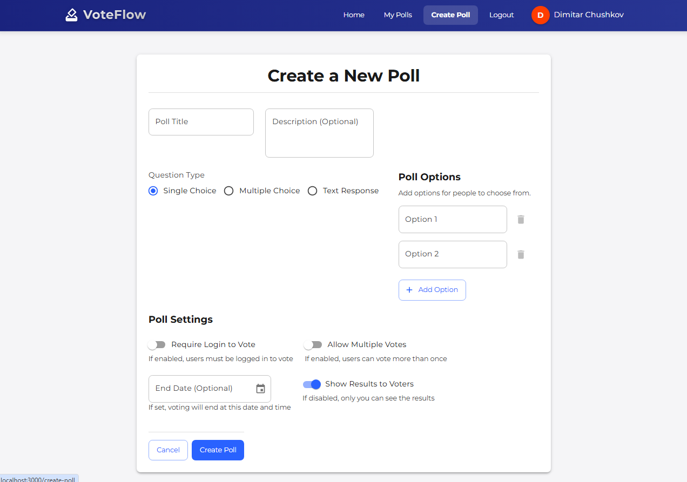
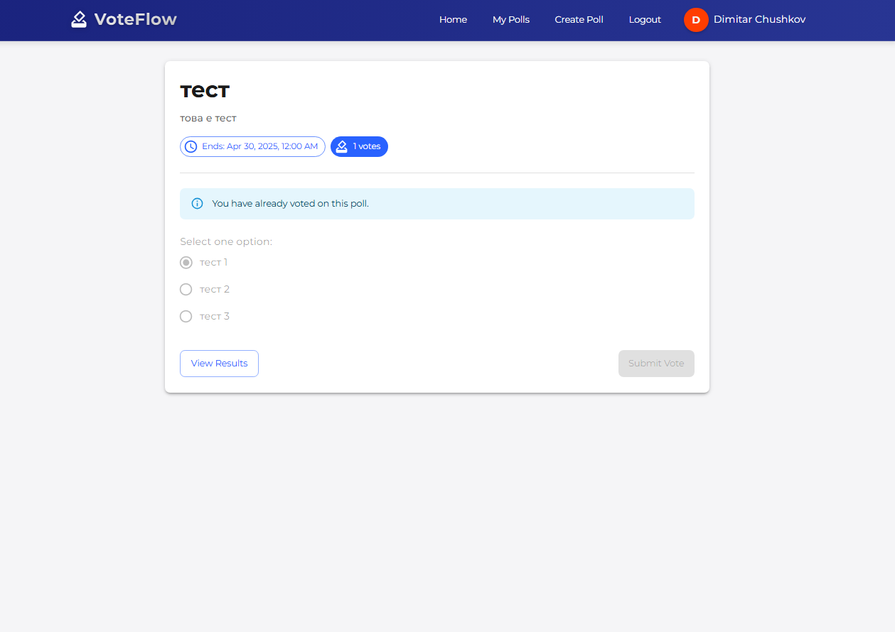
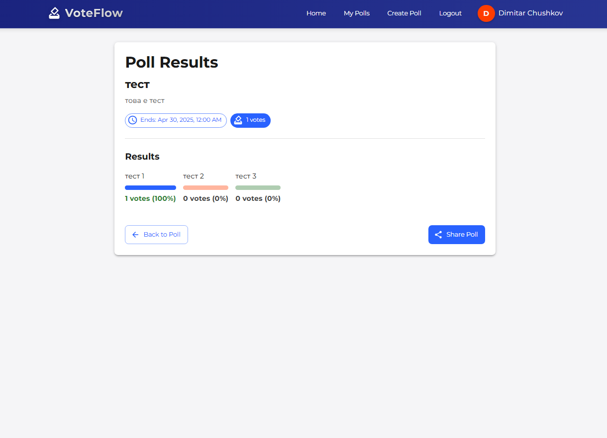
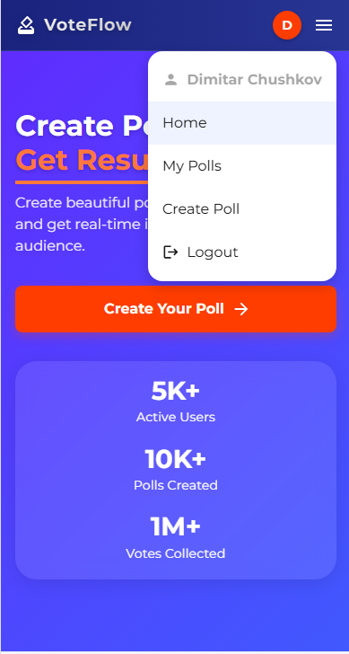

# VoteFlow

<p align="center">
  A modern, real-time polling application built with the MERN stack
</p>

<p align="center">
  <a href="#features">Features</a> •
  <a href="#demo">Demo</a> •
  <a href="#screenshots">Screenshots</a> •
  <a href="#tech-stack">Tech Stack</a> •
  <a href="#getting-started">Getting Started</a> •
  <a href="#api-endpoints">API Endpoints</a> •
  <a href="#deployment">Deployment</a> •
  <a href="#license">License</a>
</p>

## Features

✨ **Modern UI Design** - Sleek, responsive interface built with Material UI

📊 **Real-time Results** - See poll results update instantly as votes come in

🔒 **User Authentication** - Secure signup/login system with JWT

📱 **Fully Responsive** - Works seamlessly on desktop, tablet, and mobile devices

⚙️ **Customizable Polls** - Set end dates, allow multiple votes, and configure privacy settings

📝 **Multiple Question Types** - Support for single choice, multiple choice, and text responses

📈 **Results Dashboard** - Detailed statistics and visualizations for each poll


Test Account:
- Username: `demo@example.com`
- Password: `demo123`

## Screenshots

<p align="center">
  
  <br><em>Homepage - Create polls and see featured content</em>
</p>

<p align="center">
  
  <br><em>Create Poll - Easy to use form for creating custom polls</em>
</p>

<p align="center">
  
  <br><em>Vote Page - Clean interface for casting votes</em>
</p>

<p align="center">
  
  <br><em>Results - Real-time data visualization</em>
</p>

<p align="center">
  
  <br><em>Mobile View - Fully responsive design</em>
</p>

## Tech Stack

### Frontend
- **React** - Framework for building the user interface
- **Material UI** - Component library for modern design
- **React Router** - Navigation and routing
- **Axios** - HTTP client for API requests
- **Context API** - State management
- **Socket.io Client** - Real-time updates

### Backend
- **Node.js** - JavaScript runtime
- **Express** - Web application framework
- **MongoDB** - NoSQL database
- **Mongoose** - MongoDB object modeling
- **JWT** - Authentication and security
- **Socket.io** - Real-time bidirectional event-based communication

## Getting Started

### Prerequisites
- Node.js (v14+)
- MongoDB
- npm or yarn

### Installation

1. Clone the repository
```bash
git clone https://github.com/dChushkov/Vote-Flow.git
cd Vote-Flow
```

2. Install backend dependencies
```bash
cd server
npm install
```

3. Install frontend dependencies
```bash
cd ../
npm install
```

4. Create a `.env` file in the server directory with the following variables
```
NODE_ENV=development
PORT=5000
MONGO_URI=your_mongodb_connection_string
JWT_SECRET=your_jwt_secret
```

5. Start the backend server
```bash
cd server
npm run dev
```

6. Start the frontend application
```bash
cd ../
npm start
```

7. Open your browser and navigate to `http://localhost:3000`

## API Endpoints

### Authentication
- `POST /api/users/register` - Register a new user
- `POST /api/users/login` - Login user and get token

### Polls
- `GET /api/polls` - Get all polls
- `GET /api/polls/:id` - Get a specific poll
- `POST /api/polls` - Create a new poll
- `PUT /api/polls/:id` - Update a poll
- `DELETE /api/polls/:id` - Delete a poll

### Votes
- `GET /api/polls/:id/votes` - Get all votes for a poll
- `POST /api/polls/:id/votes` - Cast a vote on a poll

## Deployment

### Frontend
The frontend can be deployed to Netlify, Vercel, or GitHub Pages.

### Backend
The backend can be deployed to Heroku, Render, or Railway.

### Database
MongoDB Atlas provides a free tier for hosting your MongoDB database.

## License

This project is licensed under the MIT License - see the [LICENSE](LICENSE) file for details.

## Created By

- dChushkov - [GitHub](https://github.com/dChushkov)

---

If you find this project useful, please consider giving it a star ⭐️ on GitHub.
